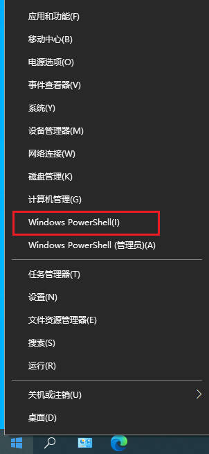
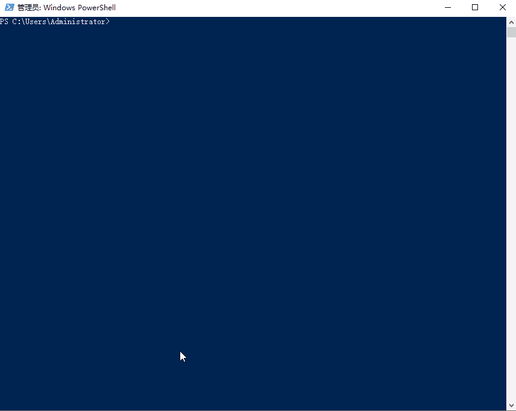
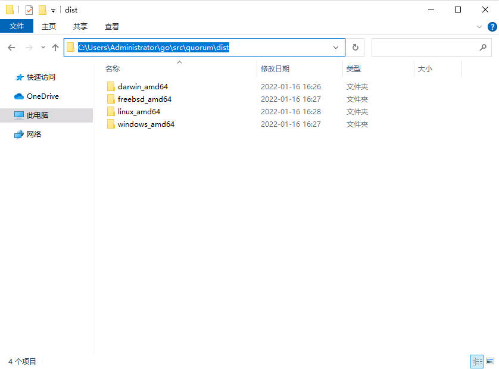

## 前情提要

[Quorum项目](https://github.com/rumsystem/quorum)的代码几乎每天都有更新，编译quorum成了我日常体验新功能（以及新bug）的必要步骤。之前的文章中提到用Gitpod在线编译quorum，但是我平常还是在本地电脑完成编译工作的，其实并不复杂。如今Windows下有不少第三方工具可以快速安装并配置好Go语言环境，我尤其喜欢Scoop这个接近Linux体验的软件包管理工具。请继续阅读我在Windows通过PowerShell命令行编译quorum的分享。

## 准备工作

找到桌面任务栏角落的Windows图标，点击右键并选择*Windows PowerShell*，打开PowerShell命令行。



## 直接上命令行

下面是我执行过的命令，只需16行便完成从Go语言环境安装、获取代码到编译quorum的工作。

```powershell
Set-ExecutionPolicy RemoteSigned -scope CurrentUser
iwr -useb get.scoop.sh | iex
scoop install git
scoop install go
mkdir go
cd go
mkdir bin
mkdir pkg
mkdir src
go env -w GOPATH=$pwd
go env -w GOPROXY=https://goproxy.cn,direct
cd src
git clone https://github.com/rumsystem/quorum
git-bash
cd quorum
./scripts/build.sh
```
其中，

- `Set-ExecutionPolicy RemoteSigned -scope CurrentUser`和`iwr -useb get.scoop.sh | iex`用于安装Scoop软件包管理工机具。

- `scoop install git`安装Git代码管理工具。

- `scoop install go`安装Go语言环境。

- ```powershell
  mkdir go
  cd go
  mkdir bin
  mkdir pkg
  mkdir src
  ```
  建立go工作空间目录结构

- `go env -w GOPATH=$pwd`和`go env -w GOPROXY=https://goproxy.cn,direct`设置Go环境变量，其中GOPROXY用于解决国内Go模块获取的问题。我这里使用了七牛云支持的goproxy.cn。

- 剩余命令，主要用于拉取quorum项目代码，并且进入git-bash然后执行编译脚本。

详细的过程请看视频。https://youtu.be/3XS5TS5-E1w



> **补充说明一下，实际scoop的软件包管理并不需要管理员权限，视频中的电脑因为被我关闭了UAC，所以默认是以管理员身份执行。**


最后，在图片所示的位置便可找到编译好的可执行程序文件。



## 扩展阅读

[「一行代码」搞定软件安装卸载，用 Scoop 管理你的 Windows 软件](https://sspai.com/post/52496)

