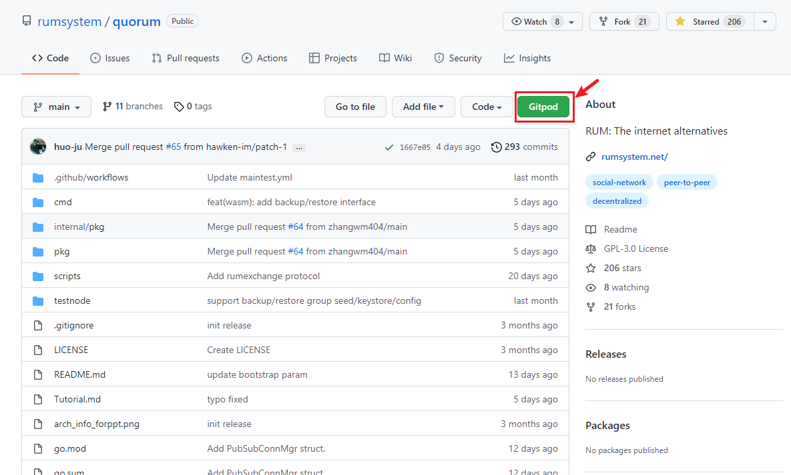
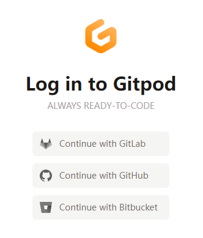
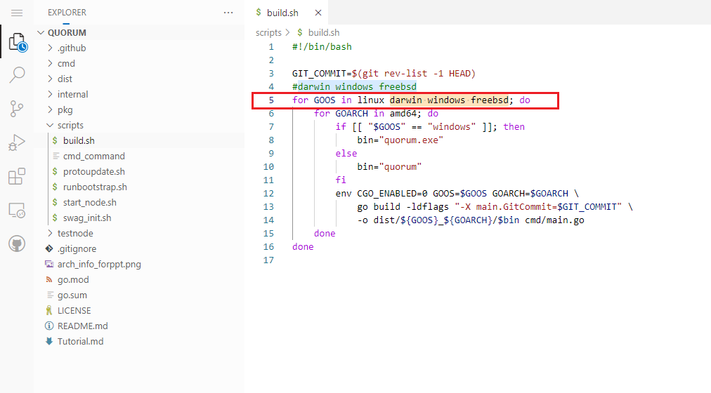
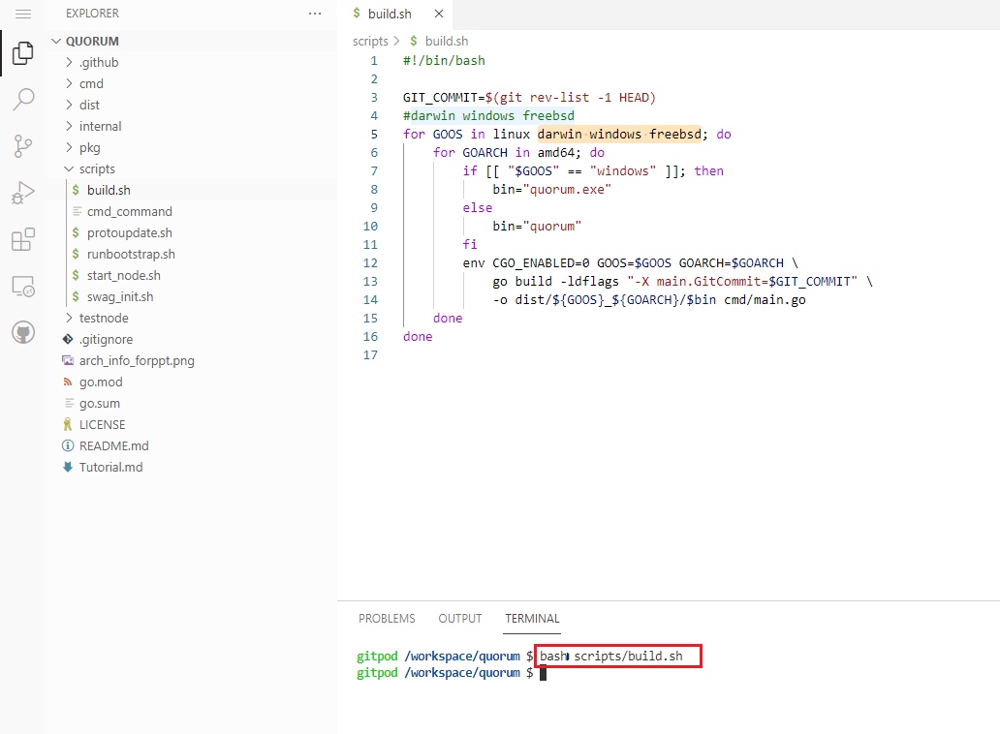
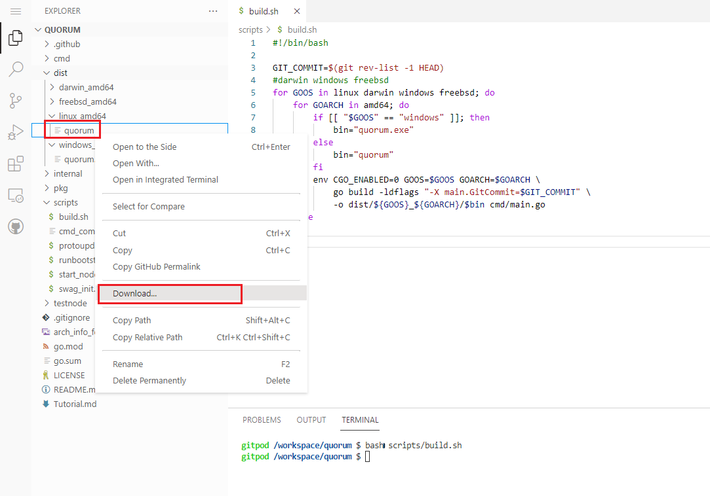
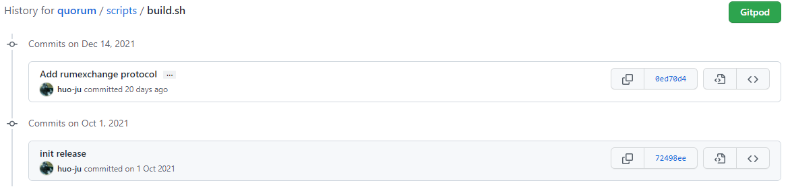
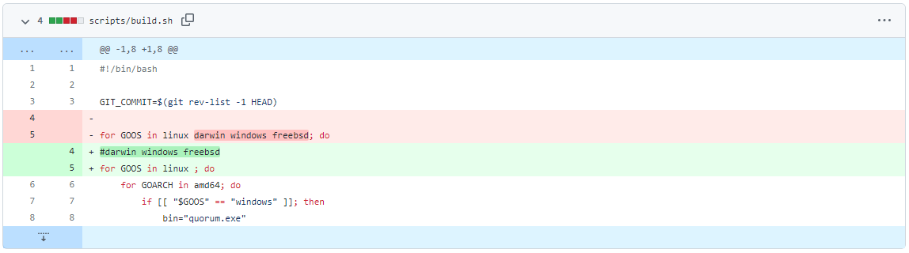

## 前情提要

上一篇文章提到的准备工作中，有一项quorum程序的编译工作。如何不用搭建本地go开发环境就能完成编译呢？因此有了本文。

## 准备工作

1. Chrome、Edge等现代浏览器，并且能无障碍访问GitHub。
2. 已注册好GitHub账号。（GitLab、Bitbucket账号也行
3. 了解一点点Linux命令。
4. 了解一点点VS Code的编辑操作。

## 我们开始吧

1. 用浏览器打开quorum的项目代码地址https://github.com/rumsystem/quorum 。

2. 点击绿色的按钮Gitpod。

3. 如下图示，可以用GitHub、GitLab或者Bitbucket账号登录Gitpod。

4. 耐心等待开发环境加载完成。（取决于网速，以及无障碍程度:P

5. 在左侧的文件列表找到scripts目录下的build.sh，点击打开。（如果只想编译Linux版的quorum，这一步可跳过，原因看[这里](#about_build)
   
6. 把第4行的darwin windows freebsd复制，并粘贴到第5行的linux 后面，如下图示，并按*CTRL+S*保存。

7. 在下方的TERMINAL窗口，输入`bash scripts/build.sh`，等待编译完成。

8. 当新的一行提示符$再出现时，编译就完成了。这时候可以到左侧的文件列表找到dist目录，找到对应操作系统的quorum程序，点击右键并选择Download下载到本地。

## 后记，关于build.sh

在以前，编译脚本build.sh是支持多操作系统交叉编译的，但是项目组在2021年12月中旬改成默认只编译Linux版本了。所以，如果需要编译对应其他操作系统的程序，则需自己编辑一下。

