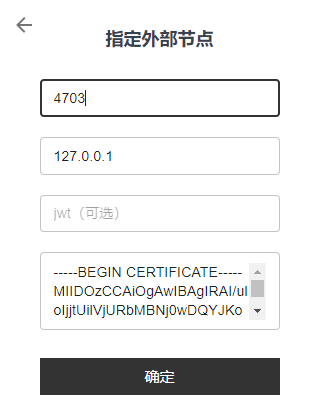
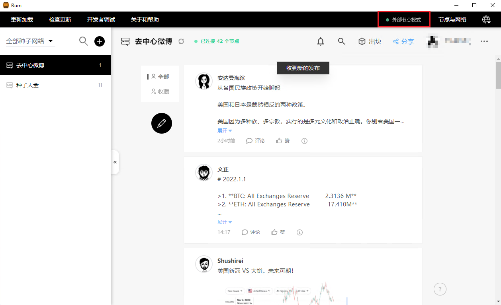

## 准备工作

1. 假定你已经有一台云服务器（VPS）在阿里云、腾讯云、Linode等云服务商。
2. 已熟悉基本的Linux和Windows命令。
3. 安装好tmux软件包，*可以通过`apt install tmux`（Ubuntu/Debian）或`yum install tmux`（CentOS）命令安装*。
4. 已有编译好的quorum程序。

## 我们开始吧

1. 通过ssh连接到VPS。
2. 执行`tmux`，这样可以简单的保持会话而不受ssh连接中断的影响。万一连接断了，重新ssh之后执行`tmux attach`可以恢复之前的会话。
3. 执行首次运行以下命令，按提示设置keystore密码。（记得保存好）
```bash
./quorum -peername [你的节点名字] -ips [你的云服务器IP],127.0.0.1 -listen /ip4/0.0.0.0/tcp/4702 -apilisten :4703 -peer /ip4/94.23.17.189/tcp/10666/p2p/16Uiu2HAmGTcDnhj3KVQUwVx8SGLyKBXQwfAxNayJdEwfsnUYKK4u,/ip4/132.145.109.63/tcp/10666/p2p/16Uiu2HAmTovb8kAJiYK8saskzz7cRQhb45NRK5AsbtdmYsLfD3RM
```
4. 下次启动quorum，可以用以下命令，这样可以跳过输入keystore密码的提示。（方便以后做成服务启动
```bash
RUM_KSPASSWD=[你的keystore密码] ./quorum -peername [你的节点名字] -ips [你的云服务器IP] -listen /ip4/0.0.0.0/tcp/4702 -apilisten :4703 -peer /ip4/94.23.17.189/tcp/10666/p2p/16Uiu2HAmGTcDnhj3KVQUwVx8SGLyKBXQwfAxNayJdEwfsnUYKK4u,/ip4/132.145.109.63/tcp/10666/p2p/16Uiu2HAmTovb8kAJiYK8saskzz7cRQhb45NRK5AsbtdmYsLfD3RM
```

5. 到certs目录下复制server.crt的内容备用。

6. 在本地以管理员身份运行cmd，然后输入以下命令把VPS的端口映射到本地。（解决直接填外部节点VPS的公网IP则报错的问题
```cmd
netsh interface portproxy add v4tov4 listenport=4703 listenaddress=127.0.0.1 connectport=4703 connectaddress=[你的云服务器IP]
```

> Mac下端口映射可以这样试试，下载并安装ncat/nmap for Mac OS X。（或者brew install nmap）http://nmap.org/download.html#macosx 
> 然后执行命令
>
> ```bash
> sudo ncat --sh-exec "ncat [云服务器IP] [云服务器端口]" -l [本地端口] --keep-open
> ```
> 参考：https://superuser.com/questions/30917/how-to-make-a-port-forward-in-mac-os-x
>

7. 启动RUM桌面版，并选择连接外部节点。


8. 填写外部节点的设置，并把之前server.crt的内容粘贴。


## 最终效果



